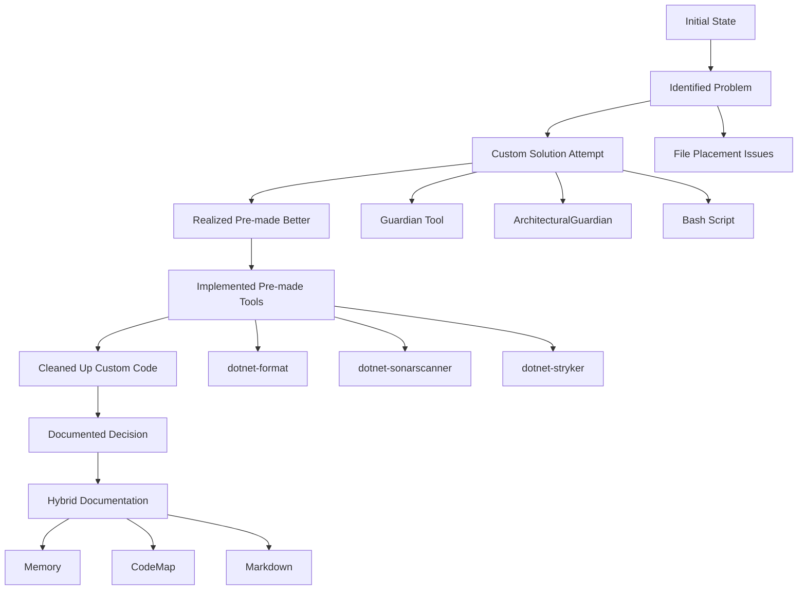

# 🏗️ GameDev Project Architecture - CodeMap

## Visual Overview

```
🎮 Game Dev Project Architecture
├── 📁 Directory Structure
│   ├── /projects/          - Runtime game projects
│   ├── /plugins/           - Reusable runtime components
│   ├── /toolkits/          - Development tools & utilities
│   ├── /scripts/           - Project automation
│   └── /docs/              - Documentation
├── 🛡️ Architectural Validation
│   ├── dotnet-format ✅    - Code formatting (307 files fixed)
│   ├── dotnet-sonarscanner ✅ - Code quality analysis
│   ├── dotnet-stryker ✅  - Mutation testing
│   └── NetArchTest.Rules ✅ - Architectural rules
└── 🎯 Core Principles
    ├── Separation of Concerns
    ├── Pre-made Tools > Custom
    ├── Immediate Value > Perfect Solution
    └── Living Documentation
```

## Project Evolution Flow



## Tool Integration Map

```
🔧 Development Tools Ecosystem
├── Code Quality
│   ├── dotnet-format → Auto-formatting
│   ├── dotnet-sonarscanner → Quality gates
│   └── dotnet-stryker → Mutation testing
├── Documentation
│   ├── Hugo → Static sites (ports 1315-1318)
│   ├── XMLDoc2Markdown → API docs
│   └── Living docs → Architecture
├── Testing
│   ├── Godot Test CLI → Headless testing
│   ├── dotnet test → Unit tests
│   └── Mutation testing → Code coverage
└── Build & Deploy
    ├── dotnet build → Compilation
    ├── Scripts → Automation
    └── Git hooks → Pre-commit validation
```

## Decision Points & Rationale

| Decision | Custom Approach | Pre-made Approach | Winner | Why |
|----------|----------------|-------------------|--------|-----|
| File Validation | Guardian tool | dotnet-format | ✅ Pre-made | Immediate, battle-tested |
| Architectural Rules | Custom C# | NetArchTest.Rules | ✅ Pre-made | Fluent API, maintained |
| Code Quality | Custom analyzers | SonarScanner | ✅ Pre-made | Enterprise features |
| Documentation | Custom generators | Hugo + XMLDoc2Markdown | ✅ Pre-made | Industry standard |

## Current Architecture State

### ✅ Working Systems
- **Code Formatting**: 307 files auto-fixed
- **Documentation**: Multiple Hugo sites running
- **Testing**: Godot CLI + dotnet test
- **Build Automation**: Scripts + git hooks

### 🔄 In Progress
- **SonarQube Integration**: Server setup needed
- **Mutation Testing**: Ready to use
- **Architectural Tests**: Can add NetArchTest.Rules

### 🎯 Next Steps
1. Set up SonarQube server for code quality
2. Integrate mutation testing in CI/CD
3. Add architectural tests to critical projects
4. Create automated documentation generation

## Memory & Documentation Strategy

```
📚 Knowledge Management
├── 🧠 Memory (AI)
│   ├── Quick decisions
│   ├── Command references
│   └── Tag relationships
├── 🗺️ CodeMap (Visual)
│   ├── Architecture overview
│   ├── Decision flows
│   └── Tool relationships
└── 📝 Markdown (Detailed)
    ├── Implementation guides
    ├── API documentation
    └── User manuals
```

## How This Project Works

### Core Philosophy
1. **Pre-made First** - Use existing tools before building custom
2. **Immediate Value** - Deliver working solutions quickly
3. **Living Documentation** - Docs evolve with code
4. **Hybrid Knowledge** - Multiple formats for different needs

### Development Workflow
```bash
# 1. Code changes
vim file.cs

# 2. Format check
dotnet format --check

# 3. Auto-fix
dotnet format style solution.sln

# 4. Test
dotnet test
godot --headless --script test_runner.gd

# 5. Quality check
dotnet-sonarscanner begin /k:project
dotnet build
dotnet-sonarscanner end

# 6. Document
hugo server --port 1316
```

### Architectural Boundaries
- **Runtime Code** → `/projects/`, `/plugins/`
- **Development Tools** → `/toolkits/`, `/scripts/`
- **Documentation** → `/docs/`
- **Build Artifacts** → Excluded from docs

## Key Insights

1. **Custom isn't always better** - Pre-made tools won
2. **Documentation needs multiple formats** - Memory + CodeMap + Markdown
3. **Architecture evolves** - Start simple, add complexity as needed
4. **Tools should integrate** - Everything works together
5. **Knowledge should be accessible** - Different formats for different needs

---

*This CodeMap serves as the visual memory for the project's architectural decisions and current state.*
